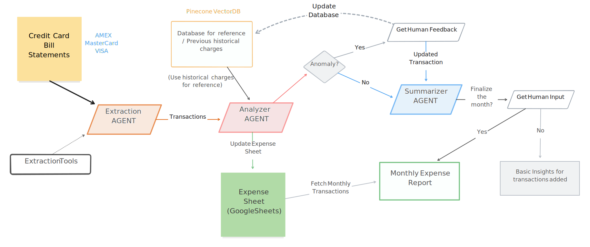

# ExpensAI: Intelligent Credit Card Statement Analysis

ExpensAI is a sophisticated multi-agent system designed to revolutionize how you manage and understand your credit card expenses. Using advanced LLM-powered agents, it automatically processes your statements, detects spending patterns, identifies anomalies, and maintains organized records in Google Sheets - all while learning from your feedback to become more personalized over time.

<p align="center">
  
</p>

## 🏗️ Architecture

<p align="center">
  
</p>

ExpensAI uses a multi-agent architecture where each agent specializes in a specific task:

1. **Extraction Agent**
   - Processes PDF statements from multiple credit card providers
   - Uses specialized parser tools for each provider
   - Extracts structured transaction data

2. **Analyzer Agent**
   - Compares transactions with historical patterns
   - Detects anomalies using vector similarity
   - Categorizes transactions
   - Updates transaction descriptions based on analysis
   - Gets human feedback for anomalous transactions

3. **Summary Agent**
   - Generates monthly expense reports
   - Provides spending insights
   - Updates expense sheets
   - Maintains historical records

The system uses two primary storage components:
- **Vector Database**: Stores transaction embeddings for pattern matching
- **Expense Sheet**: Maintains organized transaction records and summaries

## 🎥 Demo

[Coming Soon] Watch ExpensAI in action as it processes statements, identifies patterns, and organizes your expenses.

## ✨ Key Features

- **Multi-Agent Architecture**: Different specialized agents handle specific tasks:
  - Statement Parser Agent: Extracts transaction data from PDF statements
  - Analysis Agent: Detects anomalies and categorizes transactions
  - Summary Agent: Generates insightful monthly reports

- **Intelligent Statement Parsing**:
  - Supports multiple credit card providers (AMEX, ZOLVE, FREEDOM)
  - Automatic PDF statement processing
  - Robust error handling and validation

- **Smart Transaction Analysis**:
  - Anomaly detection using historical patterns
  - Automatic transaction categorization
  - Learning from user feedback
  - Vector similarity search for pattern recognition

- **Organized Storage**:
  - Automatic Google Sheets integration
  - Monthly expense tracking
  - Card-wise summaries
  - Historical data maintenance

- **Insightful Reporting**:
  - Monthly spending analysis
  - Category-wise breakdowns
  - Trend identification
  - Actionable financial insights

## 🚀 Setup Guide

### Prerequisites

1. Python 3.x
2. Credit card statements in PDF format
3. Google Cloud account
4. Pinecone account
5. Anthropic API key

### Installation

1. Clone the repository:
```bash
git clone https://github.com/SiDDyy007/expensai.git
cd expensai
```

2. Install required packages:
```bash
pip install -r requirements.txt
```

### Configuration

#### 1. Environment Setup
Create a `.env` file in the project root:
```env
# API Keys
ANTHROPIC_API_KEY=your_anthropic_api_key_here
PINECONE_API_KEY=your_pinecone_api_key_here

# Google Sheets Configuration
EXPENSE_SHEET_NAME=ExpensAI
GOOGLE_SERVICE_ACCOUNT_FILE=path/to/expensai-key.json

# Pinecone Configuration
PINECONE_ENV=production
PINECONE_INDEX_NAME=expense-vectors
```

#### 2. Google Cloud Setup

1. Create a new project in Google Cloud Console
2. Enable Google Sheets API and Google Drive API
3. Create a service account:
   - Go to "IAM & Admin" > "Service Accounts"
   - Click "Create Service Account"
   - Grant "Editor" access for Google Sheets and Drive
   - Download the JSON key file
   - Rename it to `expensai-key.json` and place it in the project root

#### 3. Pinecone Setup

1. Create a Pinecone account at https://www.pinecone.io/
2. Create a new index:
   - Dimension: 1024 (for multilingual-e5-large embeddings)
   - Metric: Cosine

#### 4. Statement Folder Setup

1. Create a `statements` folder in the project root:
```bash
mkdir statements
```

2. Place your PDF credit card statements in this folder:
```
statements/
├── AMEX.pdf
├── ZOLVE.pdf
└── FREEDOM.pdf
```

## 🏃‍♂️ Usage

1. Ensure your statements are in the `statements` folder

2. Run ExpensAI:
```bash
python app.py
```

3. The system will:
   - Process all statements
   - Analyze transactions 
   - Update Google Sheets
   - Generate monthly summary 
   - Ask for feedback when needed

## 📚 Documentation

The project follows a clear structure:

```
expensai/
├── config/        # Configuration management
├── parser_tools/  # Statement parsing logic
├── analysis/      # Transaction analysis
├── storage/       # Data storage (Sheets & Vector)
└── app.py         # Main LLM agent implementations
```

## 🤝 Contributing

Contributions are welcome! Please feel free to submit a Pull Request.

## 🙏 Acknowledgments

- [Anthropic](https://www.anthropic.com/) for Claude API
- [Pinecone](https://www.pinecone.io/) for vector storage
- [SmoLAgents](https://huggingface.co/docs/smolagents/index) for agent framework